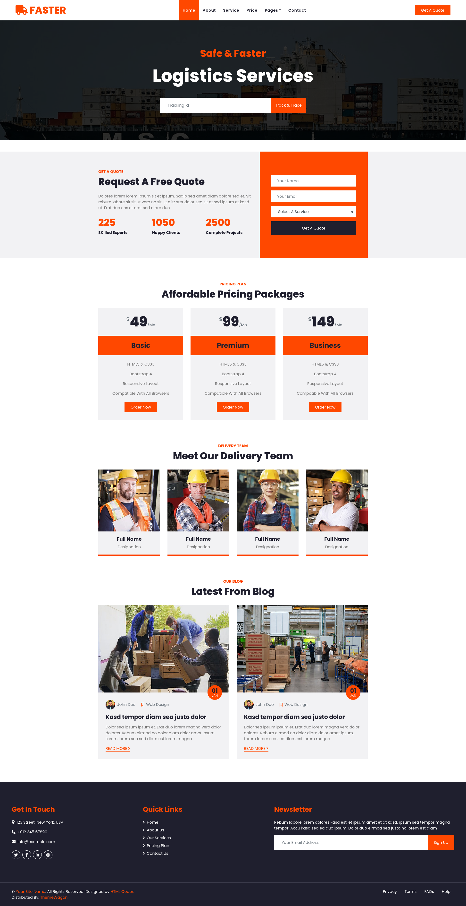

# Atividade - Landing Page

Este repositório contém uma landing page (página estática) responsiva criada por mim como atividade da turma FullStack Live da Digital College. A atividade possuía modelos protótipos como base e possuía como requisitos:

* Construir o HTML e CSS a partir da análise do protótipo, apenas através da observação visual, tentando identificar as tags que serão utilizadas e os estilos que deverão ser aplicados;
* Uso de bibliotecas adicionais (Bootstrap, Tailwind, Fonts, Icons, etc);
* Entregar o design visual como está no protótipo;
* Reutilizar os estilos utilizando seletores;
* Tipografia condizente (strong, itálico, proporcionalidade);
* HTML semântico;
* Landing page disponível no Github Pages.

O protótipo da página pode ser visto a seguir:
